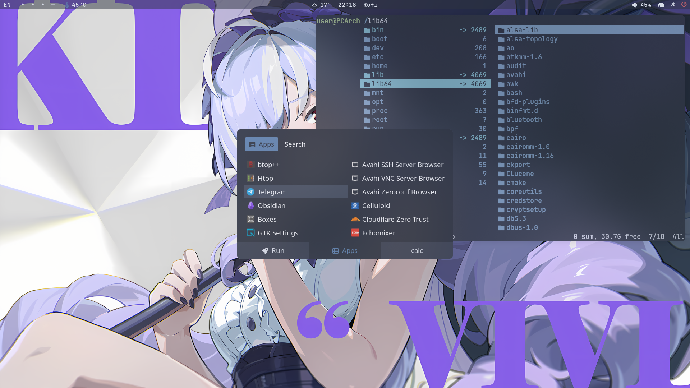

<h1 align="center"> :herb: Vitalij35 Build :herb: </h1>

<!-- BADGES -->
 

  
   
  
  
   

<!-- INFORMATION -->
Builder that I use is a fork of [**`Zproger builder`**](https://github.com/Zproger/bspwm-dotfiles)
<h1 align="left"> :blue_book: About</h1> 

 

 - OS: [**`Arch Linux`**](https://archlinux.org/)
 - WM: [**`Hyprland`**](https://hyprland.org/)
 - Bar: [**`Waybar`**](https://github.com/Alexays/Waybar)
 - Terminal: [**`Kitty`**](https://github.com/kovidgoyal/kitty)
 - App Launcher: [**`Rofi`**](https://github.com/davatorium/rofi)
 - Notify Daemon: [**`Mako`**](https://github.com/emersion/mako)
 - Shell: [**`Fish`**](https://github.com/fish-shell/fish-shell)

 

<!-- IMAGES -->
## 🖼️ Gallery

<table align="center">
   <tr>
      <th align="center">
         :warning: WARNING :warning:
      </th>
   </tr>
   <tr>
      <td align="center">
        THIS CONFIGURATION IS DESIGNED FOR 1920X1080 MONITORS,
        SOME FUNCTIONALITY OF THE SHELL MAY NOT WORK AS IT SHOULD.
        IN THIS CASE YOU NEED TO MAKE ADJUSTMENTS MANUALLY.
        IF YOU FIND ERRORS IN THE SHELL, PLEASE REPORT THE PROBLEM.
   </tr>
   </table>

<!-- INSTALLATION -->
## :blue_book: Installation
A guide to installing the system and graphical shell via builder: [EN](Docs/01_installing_arch_linux_with_bspwm_english.md), [RU](Docs/00_installing_arch_linux_with_bspwm_russian.md). 

<!-- HOTKEYS -->
## 💻 HotKeys
* **Open the terminal** - `super + enter`
* **Set a random wallpaper** - `super + w`
* **Open the application menu** - `super + r`
* **Recognize the color on the screen** - `super + x`
* **Lock the screen** - `super + l`
* **Close the window that is in focus** - `super + q`
* **Take a screenshot** - `print`
* **Switch to another desktop** - `super + 1/6`
* **Move the window to another desktop** - `super + shift + 1/6`
* **Switch the window to floating mode** - `super + a`

The other hotkeys are in `~/.config/hypr/hyprland.conf`.
